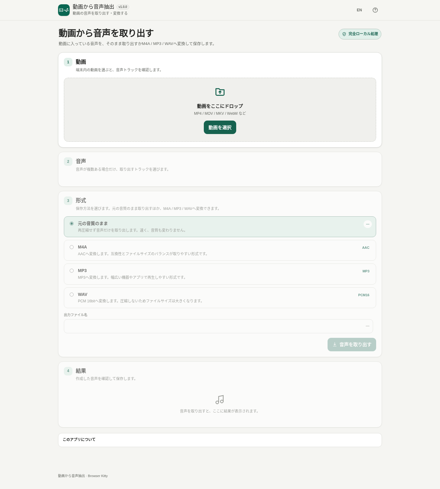

# 動画から音声抽出 / Video Audio Extractor

[](https://github.com/ttomohisa/htmlapps-video-audio-extractor/actions/workflows/deploy-pages.yml)
[](LICENSE)
[](video-audio-extractor.html)
[](https://github.com/ttomohisa/htmlapps-ffmpeg-wasm-builder/releases/tag/v1.10.0)

[English README](README.md)

動画に入っている音声トラックを1つ選び、選択した動画をサーバーへアップロードせず、ブラウザー内で音声ファイルとして取り出すBrowser Kittyアプリです。対応する音声は元の音質のまま保存でき、M4A / MP3 / WAVへの変換も端末内で行います。

現在のアプリバージョンは **v1.0.0** です。

## 🚀 デモ

リポジトリ公開後にGitHub Pagesを有効にすると、次のURLで利用できます。

### [Video Audio ExtractorをGitHub Pagesで開く](https://ttomohisa.github.io/htmlapps-video-audio-extractor/)

GitHub Pagesから最初のHTMLを取得した後、動画解析、音声抽出、変換、プレビュー、出力作成はブラウザー内で行います。選択した動画をアプリからサーバーへアップロードしません。

[](https://ttomohisa.github.io/htmlapps-video-audio-extractor/)

## 主な機能

- **対応する音声は再エンコードせず抽出** — AAC→M4A、ALAC→M4A、MP3→MP3、Opus→OPUS、Vorbis→OGG、FLAC→FLACは確認済みのストリームコピー経路を使います。
- **M4A / MP3 / WAVへ変換** — AAC、LAME 4.0 MP3、PCM16 WAVへ端末内で変換できます。
- **複数音声から必要なトラックを選択** — ファイルに含まれていれば、言語、タイトル、標準トラック情報を表示します。
- **大きな動画を最初にJavaScriptへ丸ごと複製しない** — 元の `File` / `Blob` をWORKERFSへマウントし、最初に `File.arrayBuffer()` で動画全体を読み込みません。
- **単一HTMLで利用** — FFmpeg JavaScript、WebAssembly、ブラウザーruntime、UIをstandalone HTMLへ内包します。
- **HTML取得後はオフライン利用可能** — 対応ブラウザーでは保存したHTMLを `file://` で直接開けます。
- **実行時の外部通信なし** — `connect-src 'none'` を含むCSPを使用し、CDN、Analytics、Telemetry、外部フォント、実行時アップデート確認を行いません。
- **日本語 / 英語、PC / スマートフォン対応** — 同じHTML内で言語を切り替え、スマホでは「動画 / 音声 / 形式 / 結果」のステップUIを使います。

## すぐ使う

### Webデモを使う

GitHub Pages有効化後は [Webデモ](https://ttomohisa.github.io/htmlapps-video-audio-extractor/) を開くだけです。アカウント登録やインストールは不要です。

### 単一HTMLを使う

1. このリポジトリから `video-audio-extractor.html` を取得します。
2. 現行のChromeまたはEdgeで開きます。
3. 端末内の動画を選択またはドロップします。
4. 音声が複数ある場合は、取り出す音声を選びます。
5. **元の音質のまま / M4A / MP3 / WAV** を選びます。
6. **音声を取り出す** を押し、結果を確認して保存します。

ローカルサーバーや動画のアップロードは不要です。

### 小さいSelf-extract版を使う

次を開きます。

```text
dist/index.self-extract.html
```

`DecompressionStream` を使って通常版HTMLを端末内で展開します。展開中にサーバーへ通信しません。

## 使い方

1. ファイル選択またはDrag & Dropで動画を追加します。
2. 端末内での解析が終わるまで待ちます。複数音声がある場合は対象トラックを選びます。
3. 保存方法を選びます。
4. M4A / MP3ではbitrateを選びます。MP3はモノラル / ステレオも選択できます。
5. 必要なら出力ファイル名を変更し、**音声を取り出す** を押します。
6. ブラウザーが再生できる形式なら結果をプレビューし、音声ファイルを保存します。
7. **設定を変えてもう一度** を使うと、元動画を残したまま形式設定へ戻れます。

未保存の完成結果がある状態で新しい動画を開く場合は、置き換える前に確認します。

## 対応する出力

### 元の音質のまま

| 元の音声 | 出力 | 処理 |
| --- | --- | --- |
| AAC | M4A | ストリームコピー |
| ALAC | M4A | ストリームコピー |
| MP3 | MP3 | ストリームコピー |
| Opus | OPUS | ストリームコピー |
| Vorbis | OGG | ストリームコピー |
| FLAC | FLAC | ストリームコピー |

MPEG-TS AAC → M4Aも、`aac_adtstoasc` を含めBuilderの実ブラウザーsmokeで確認しています。

### 変換

| 出力 | エンコード設定 |
| --- | --- |
| M4A | FFmpegネイティブAAC、128 / 192 / 256 kbps |
| MP3 | LAME 4.0 / `libmp3lame`、128 / 192 / 256 / 320 kbps、モノラル / ステレオ |
| WAV | PCM signed 16-bit little-endian |

MP3では3チャンネル以上の元音声を、選択したモノラル / ステレオへ変換します。

## GitHub Pagesで公開する

リポジトリには、単一HTMLを再生成・検証し、GitHub Pagesが有効な場合に `dist/` を公開するworkflowを含めています。

1. リポジトリを `ttomohisa/htmlapps-video-audio-extractor` として公開します。
2. **Settings → Pages → Build and deployment → Source** で **GitHub Actions** を選びます。
3. `main` へpushするか、Actionsから **Deploy standalone app to GitHub Pages** を手動実行します。
4. 成功後は `https://ttomohisa.github.io/htmlapps-video-audio-extractor/` で利用できます。

Pages未設定でもworkflowはビルド検証とstandalone artifactの保存を行います。

## 開発・ビルド構成

```text
.
├─ src/index.template.html              # UIとアプリロジック
├─ vendor/ffmpeg/                       # 固定済みFFmpeg WASM profile
├─ assets/
│  ├─ favicon.svg
│  ├─ screenshot.png
│  ├─ screenshot-en.png
│  └─ screenshot-mobile.png
├─ app.config.json                      # アプリ情報と出力設定
├─ build-standalone.bat                 # Windowsビルド入口
├─ build-standalone.ps1                 # 単一HTMLビルダー
├─ build-with-local-ffmpeg.bat          # 開発用Builder取り込み
├─ import-release-ffmpeg.bat            # v1.10.0正式Release ZIP取り込み
├─ scripts/
│  ├─ check-repository.ps1              # リポジトリ全体検証
│  ├─ verify-standalone.ps1             # standalone / CSP検証
│  ├─ build-self-extract.ps1            # 圧縮版生成
│  ├─ verify-self-extract.ps1           # 展開後のbyte一致確認
│  ├─ import-local-ffmpeg.ps1           # 開発用ローカルBuilder取り込み
│  └─ import-release-ffmpeg.ps1          # SHA-256検証付きRelease取り込み
├─ dist/
│  ├─ index.html
│  ├─ index.self-extract.html
│  ├─ dependency-manifest.json
│  ├─ self-extract-manifest.json
│  └─ build-size-report.json
└─ video-audio-extractor.html            # dist/index.htmlと完全一致
```

### ローカルビルド

Windowsで次を実行します。

```bat
build-standalone.bat
```

ビルド時に、profile、ストリームコピー対応、M4A / WAV / MP3変換、LAME encoder、WORKERFS / `file://`、Builder v1.10.0正式Release provenance、実行時ネットワーク境界を検証します。

生成HTMLを直接編集せず、`src/index.template.html` を変更して再ビルドします。

### FFmpeg正式Release coreを取り込み直す

v1.0.0は次へ固定しています。

```text
Builder tag: v1.10.0
Asset:       ffmpeg-wasm-video-audio-extractor-v1.10.0.zip
SHA-256:     e7b1f45792b1589b6b7d82f61d0ec3cb06c11e9404e6333d26c5a12bcf216a4f
```

Builder Releaseからこのassetを取得した後、次で検証・取り込みできます。

```bat
import-release-ffmpeg.bat "C:\path\to\ffmpeg-wasm-video-audio-extractor-v1.10.0.zip"
build-standalone.bat
```

ZIPのbyte数またはSHA-256が正式assetと異なる場合は取り込みを中止します。`vendor/ffmpeg/provenance.json` にはRelease ID、asset ID、対応ソースarchive、BUILDINFO checksum、release commitも記録します。

Builder開発中だけは `build-with-local-ffmpeg.bat` でローカルprofileを取り込めます。この経路は `developmentOnly` 扱いで、正式版のrepository checkは通りません。

## プライバシーと実行時通信

選択した動画を端末内に保つため、生成アプリは次の構成です。

- `connect-src 'none'` で実行時の外部接続を遮断します。
- FFmpeg JavaScript、WebAssembly、ブラウザーruntimeをHTMLへ内包します。
- 元動画はWORKERFSへマウントし、最初に動画全体をJavaScriptメモリへ複製しません。
- CDN、外部フォント、Analytics、Telemetry、外部API、実行時dependency checkを使いません。
- LocalStorageへ保存するのはUI言語、最後の出力形式、M4A bitrate、MP3 bitrate、MP3 mono/stereo設定だけです。
- 動画・音声の内容、ファイル名、トラック情報、処理履歴、生成音声、Blob URLはLocalStorageへ保存しません。

GitHub Pages版では最初のHTML取得にはネットワークを使いますが、読み込み後の動画解析・音声生成はブラウザー内で行います。

## 制限事項

- 通常のファイル選択は動画向けです。音声ファイルだけを選んだ場合は、このツールの用途外として案内します。
- AC-3 / E-AC-3は、現行profileの確認済み互換性matrixに専用ケースがないため、「元の音質のまま」の出力として表示しません。
- WORKERFSで最初の全量コピーを避けても、非常に大きい・長い動画ではWASMメモリ、出力サイズ、端末性能、空き容量の制約を受けます。
- ブラウザーが生成した音声形式を再生できない場合、アプリ内プレビューはできません。その場合でも保存できることがあります。
- 処理はsingle-threadで、`SharedArrayBuffer` やcross-origin isolationを必要としません。

## FFmpeg WASM依存

内包する処理coreは `ttomohisa/htmlapps-ffmpeg-wasm-builder` **v1.10.0** の `video-audio-extractor` profileです。

| コンポーネント | バージョン / source | 用途 |
| --- | --- | --- |
| FFmpeg | `n9.0.1`、commit `bf1b838f2ab88b4f8fd83443325c782ea0e0f7fa` | media解析、ストリームコピー、decode / encode |
| Emscripten | `6.0.6` | WebAssembly toolchain / runtime |
| LAME | `4.0` | `libmp3lame` によるMP3 encoding |
| Builder profile | v1.10.0 `video-audio-extractor` | ブラウザー向けFFmpeg WASM package |

Builder manifestが報告する生成profile licenseは `LGPL-2.1-or-later` です。正式Release binary assetのSHA-256は `e7b1f45792b1589b6b7d82f61d0ec3cb06c11e9404e6333d26c5a12bcf216a4f`、対応ソースarchiveのSHA-256は `0f087fe1e3992f2a6569849e06f41baff0d492a048d5eb86c09fa4c81c7d1493` です。

ライセンスとソース提供情報は [THIRD_PARTY_NOTICES.md](THIRD_PARTY_NOTICES.md) を参照してください。

## Contributing

リポジトリ公開後の不具合報告・機能提案はGitHub Issuesで受け付けます。開発手順は [CONTRIBUTING.md](CONTRIBUTING.md) を参照してください。

## License

Copyright © 2026 ttomohisa

アプリ本体は [MIT License](LICENSE) です。内包するFFmpeg / LAME等には別のライセンス条件があります。詳細は [THIRD_PARTY_NOTICES.md](THIRD_PARTY_NOTICES.md) を参照してください。
